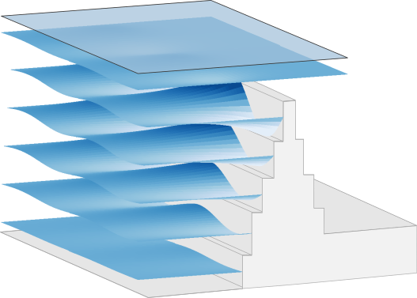
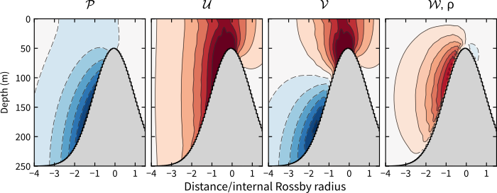

# RidgeTrappedWave
Python code to calculate properties of an internal Kelvin wave propagating alongside a ridge, step, or coast.

The code was originally designed solely for a ridge, hence the name, but was later adapted to the coastal case as well.



*A wave travelling into the page against a ridge that is built from of arbitrary number of flat-bottom regions.*

Properties of the ridge-trapped wave that are calculated include

- Wavelength
- Pressure perturbation
- Baroclinic velocities

For example, mode shapes for a Gaussian ridge with ω = 0.8*f* look like



This is a supplement to a paper in preparation:

Hughes and Klymak (2018) Tidal conversion and dissipation at steep topography in a channel poleward of the critical latitude

Using this code without the associated paper is not recommended. Please email me if interested at this early stage.

As described in the docstring, ridge-trapped wave properties are calculated following the examples below

### Constant stratification

```python
    >>> x = 0, 3000
    >>> z = 250, 50, 250
    >>> omega = 0.9
    >>> N0 = 6E-3
    >>> lat = 80
    >>> r = RidgeTrappedWave(x, z, omega, N0, lat, lambda_guess=40e3)
    >>> r.calc_wavelength_and_coefficients(niter_max=8, print_iterations=True)
    >>> # r.contour_mode_shapes() # Plot solution
    >>> print(r)
    Iterating
    λ (km)      ω
    40.0
    44.4        0.917
    46.12       0.9047
    46.13       0.9001
    Converged to specified accuracy
    Now calculating eigenmode
    Ridge Trapped Wave with wavelength of 46.1 km
```

### Vertically variable stratification

```python
    >>> N = [[8E-3, 0], [6E-3, 125], [2E-3, 250]]
    >>> lat = 80
    >>> r = RidgeTrappedWave(x, z, omega, N, lat, lambda_guess=40e3)
    >>> r.calc_wavelength_and_coefficients(niter_max=8)
    >>> # r.contour_mode_shapes() # Plot solution
    >>> print(r)
    Calculating vertical modes and matching matrices
    Iterating
    λ (km)      ω
    40.0
    44.4        0.924
    49.2        0.912
    49.27       0.9002
    Converged to specified accuracy
    Now calculating eigenmode
    Ridge Trapped Wave with wavelength of 73.0 km
```
## Usage Notes

- The distance between steps should ideally be a small fraction of the internal Rossby radius
- For omega very close to 1 (i.e., greater than 0.95), plots of U and V will be noisy.
- The internal Rossby radius for the problem is calculated from the leftmost depth. Therefore, the left side of the ridge should be equal to or deeper than the seafloor on the right side of the ridge.
- Code may or may not work when negative latitudes are used. Just use positive ones.
- The main eigenvalue problem involves M × M matrices, where M is 2 × number of modes × number of steps. Hence, when the number of steps gets large (> 50), calculating the solution may take several minutes.
- The coastal problem (i.e., where depth goes to zero) has undergone only limited testing.
- If the solution doesn't clearly converge, try a different value for `lambda_guess`

